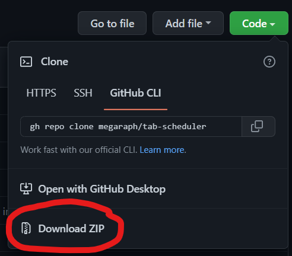
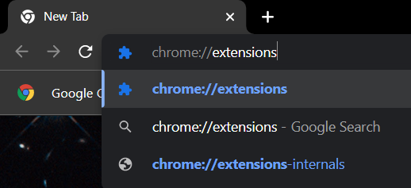
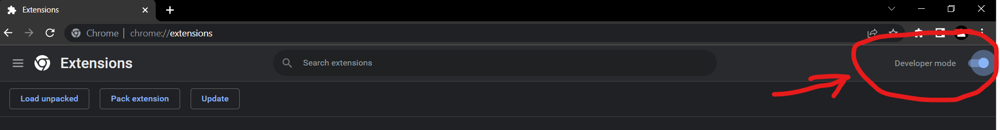
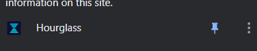
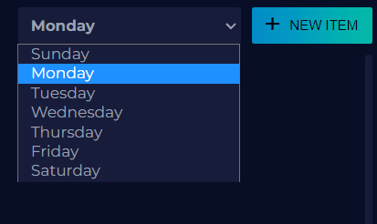
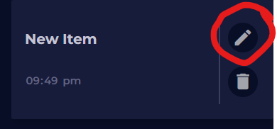
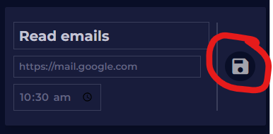

<div id="top"></div>

[![Contributors][contributors-shield]][contributors-url]
[![Forks][forks-shield]][forks-url]
[![Stargazers][stars-shield]][stars-url]
[![Issues][issues-shield]][issues-url]
[![GNU General Public License][license-shield]][license-url]


<!-- PROJECT LOGO -->
<br />
<div align="center">
  <a href="https://github.com/megaraph/tab-scheduler">
    
  </a>

<h3 align="center">Hourglass</h3>

  <p align="center">
    Do you find switching tabs repetitive? Does it follow a schedule? Hourglass has got you covered. Hourglass aims to improve your productivity by automating your tabs. All you need to do is input the time and the URL to that tab and Hourglass opens it for you on that exact time. Try it now!
    <br />
    <a href="https://github.com/megaraph/tab-scheduler"><strong>Explore the docs »</strong></a>
    <br />
    <br />
    <a href="https://github.com/megaraph/tab-scheduler/issues">Report Bug</a>
    ·
    <a href="https://github.com/megaraph/tab-scheduler/issues">Request Feature</a>
  </p>
</div>


<!-- TABLE OF CONTENTS -->
<details>
  <summary>Table of Contents</summary>
  <ol>
    <li>
      <a href="#about-the-project">About The Project</a>
      <ul>
        <li><a href="#built-with">Built With</a></li>
      </ul>
    </li>
    <li>
      <a href="#getting-started">Getting Started</a>
      <ul>
        <li><a href="#prerequisites">Prerequisites</a></li>
        <li><a href="#installation">Installation</a></li>
      </ul>
    </li>
    <li><a href="#usage">Usage</a></li>
    <li><a href="#roadmap">Roadmap</a></li>
    <li><a href="#contributing">Contributing</a></li>
    <li><a href="#license">License</a></li>
    <li><a href="#contact">Contact</a></li>
    <li><a href="#acknowledgments">Acknowledgments</a></li>
  </ol>
</details>


<!-- ABOUT THE PROJECT -->
## About The Project

![Product Name Screen Shot][product-screenshot]

<p align="right">(<a href="#top">back to top</a>)</p>

### Built With

* [![JavaScript][Javascript.com]][Javascript-url]
* [![Manifest V3][Manifest.v3]][Manifest-url]

<p align="right">(<a href="#top">back to top</a>)</p>


<!-- GETTING STARTED -->
## Getting Started

### Installation (via zipped file)

1. Click on the `code` button and download zip file

2. Store zip file in any file location of your choice
3. Extract zip file 
4. Go to your browser and go to its extensions settings. For Chromium based browsers, you may paste the following in your URL bar. 
  ```
  chrome://extensions
  ```
  
5. Find the developer mode option and toggle it on.
  
6. Click on the `Load unpacked` button and select the extracted folder from `step 3`. <br>
7. You may pin the extension if you wish.
  

### Installation (via git clone)
1. Clone repository
  ```sh
  git clone https://github.com/megaraph/tab-scheduler.git
  ```
2. Follow steps 4 to 5 in the installation guide for zipped file.
3. Click on the `Load unpacked` button and select the cloned repository folder
4. You may pin the extension if you wish.
  

<p align="right">(<a href="#top">back to top</a>)</p>


<!-- USAGE EXAMPLES -->
## Usage
Some of the use cases of this extension:
- Reminder to open a tab at a certain time.
- Opening up recurring links to online meetings.
- Remembering a video premier on YouTube.
- Opening up a Twitch stream based on a streamer's schedule.
- And more...

### Using the extension

1. Select a day in the dropdown. The current day is selected by default.
  
2. Click on the `NEW ITEM` button
3. Click on the edit button to fill in tab details.
  
4. Fill in details for the tab you want to open.
5. Click the save button. Make sure to click the save button before exiting the extension. Pressing the enter key on your keyboard does not work.
  


<p align="right">(<a href="#top">back to top</a>)</p>


<!-- CONTRIBUTING -->
## Contributing

Contributions are what make the open source community such an amazing place to learn, inspire, and create. Any contributions you make are **greatly appreciated**.

If you have a suggestion that would make this better, please fork the repo and create a pull request. You can also simply open an issue with the tag "enhancement".
Don't forget to give the project a star! Thanks again!

1. Fork the Project
2. Create your Feature Branch (`git checkout -b feature/AmazingFeature`)
3. Commit your Changes (`git commit -m 'Add some AmazingFeature'`)
4. Push to the Branch (`git push origin feature/AmazingFeature`)
5. Open a Pull Request

<p align="right">(<a href="#top">back to top</a>)</p>


<!-- LICENSE -->
## License

Distributed under the GNU General Public License. See `LICENSE.txt` for more information.


<!-- MARKDOWN LINKS & IMAGES -->
<!-- https://www.markdownguide.org/basic-syntax/#reference-style-links -->
[contributors-shield]: https://img.shields.io/github/contributors/megaraph/tab-scheduler.svg?style=for-the-badge
[contributors-url]: https://github.com/megaraph/tab-scheduler/graphs/contributors
[forks-shield]: https://img.shields.io/github/forks/megaraph/tab-scheduler.svg?style=for-the-badge
[forks-url]: https://github.com/megaraph/tab-scheduler/network/members
[stars-shield]: https://img.shields.io/github/stars/megaraph/tab-scheduler.svg?style=for-the-badge
[stars-url]: https://github.com/megaraph/tab-scheduler/stargazers
[issues-shield]: https://img.shields.io/github/issues/megaraph/tab-scheduler.svg?style=for-the-badge
[issues-url]: https://github.com/megaraph/tab-scheduler/issues
[license-shield]: https://img.shields.io/github/license/megaraph/tab-scheduler.svg?style=for-the-badge
[license-url]: https://github.com/megaraph/tab-scheduler/blob/main/LICENSE.txt
[product-screenshot]: images/product-shot.png
[Javascript.com]: https://img.shields.io/badge/JavaScript-fcfc02?style=for-the-badge&logo=javascript&logoColor=black
[Javascript-url]: https://developer.mozilla.org/en-US/docs/Web/javascript
[Manifest.v3]: https://img.shields.io/badge/Manifest%20v3-000000?style=for-the-badge&logo=google%20chrome&logoColor=yellow
[Manifest-url]: https://developer.chrome.com/docs/extensions/mv3/intro/